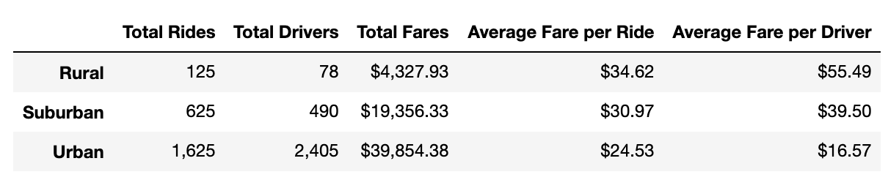

# An analysis of ride-sharing data in different city types

## Overview of the analysis
The purpose of this analysis is to show the relationship between city types and various ride-sharing indices, in order to develop better strategy and deliver better ride-sharing service.

## Results
Using images from the summary DataFrame and multiple-line chart, describe the differences in ride-sharing data among the different city types.

## Summary
1.
2.
3.